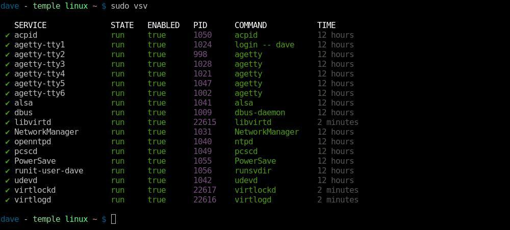
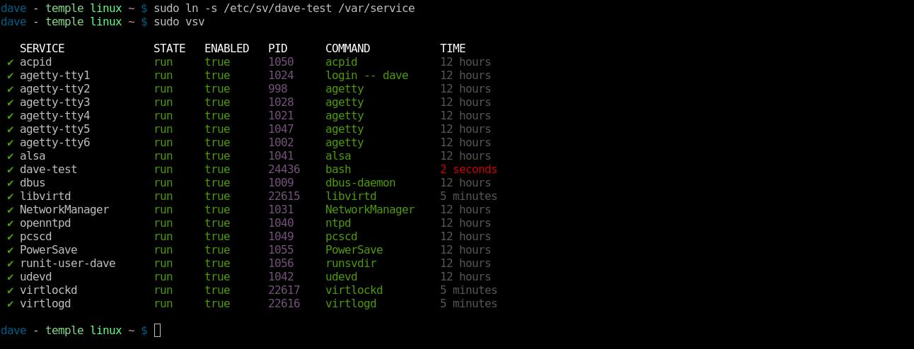
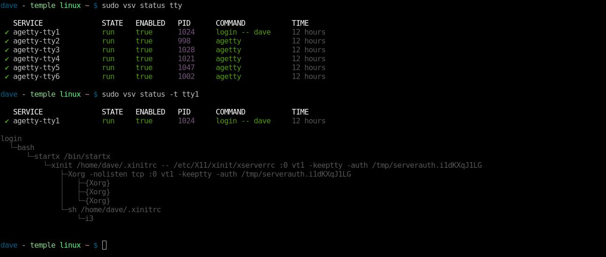
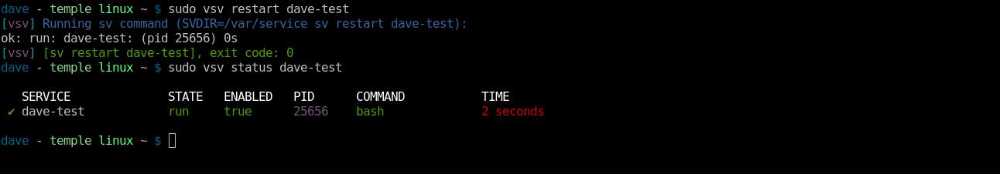
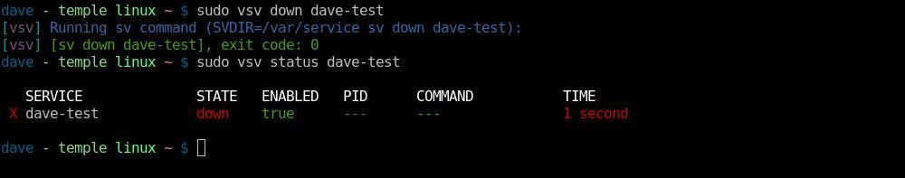
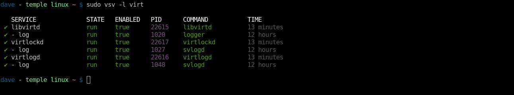
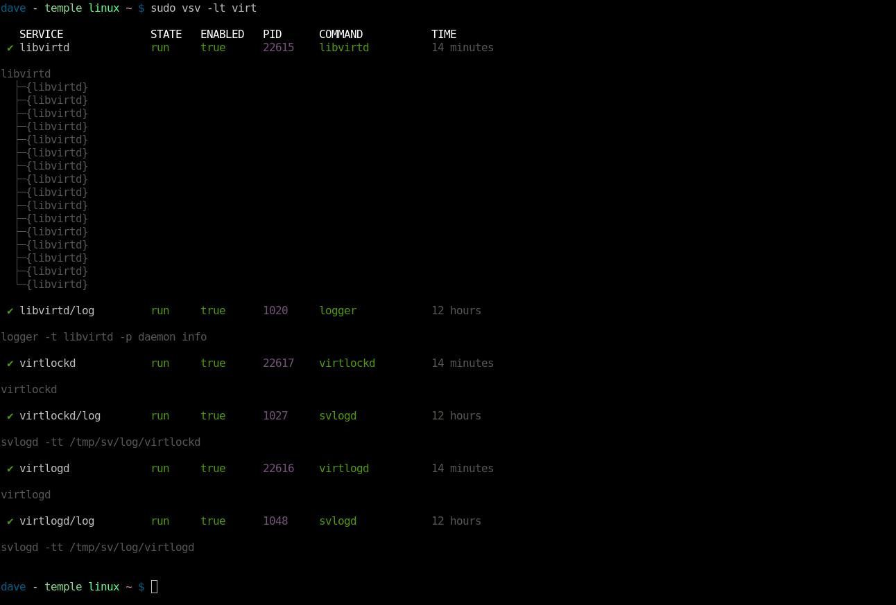

`vsv` - Void Service Manager
============================

Manage and view runit services.

`vsv` was inspired by [`vpm`](https://github.com/netzverweigerer/vpm).  `vsv` is
to `sv` as `vpm` is to the `xbps-*` commands.

See my blog post on `vsv` here: https://www.daveeddy.com/2018/09/20/vsv-void-service-manager/



Installation
------------

On [Void Linux](https://voidlinux.org/) run:

    xbps-install vsv

Alternative Installation
------------------------

`vsv` is a standalone bash script that can be dumped anywhere in your `$PATH`
to be used.

### `git`

I personally install it with `git` (with `~/bin` in my `$PATH`):

    mkdir -p ~/bin ~/dev
    cd ~/dev
    git clone git://github.com/bahamas10/vsv.git
    ln -s ~/dev/vsv/vsv ~/bin

### `curl` or `wget`

You can use `curl` or `wget` to pull the script directly from GitHub:

    mkdir -p ~/bin
    cd ~/bin
    wget https://raw.githubusercontent.com/bahamas10/vsv/master/vsv
    # or
    curl -O https://raw.githubusercontent.com/bahamas10/vsv/master/vsv
    # and then
    chmod +x ~/bin/vsv

### `Makefile`

You can use the Makefile in this repo:

    $ sudo make install
    cp vsv /usr/local/bin
    cp man/vsv.8 /usr/local/share/man/man8/vsv.8

And uninstall with:

    $ sudo make uninstall
    rm -f /usr/local/bin/vsv
    rm -f /usr/local/share/man/man8/vsv.8

Examples
--------

**Note:** Some screenshots are outdated or command output may have changed
slightly in newer versions of `vsv`.

Run `vsv` without any arguments to get process status.  This is equivalent to
running `vsv status`:


**Note:** `sudo` or escalated privileges are required to determine service state
because of the strict permissions on each service's `supervise` directory.

`vsv` scans the `/var/service` directory by default, which can be overridden by
setting the `$SVDIR` environmental variable or passing in a `-d <dir>` argument.
Any service that has been in a state for less than 5 seconds will be marked
in red, making new or failing services easy to spot:



Services in a state for more than 5 seconds but less than 30 seconds will be
highlighted in yellow:


A string can be passed as the first argument after `status` to filter for
services that contain that string in their name.  Also, `-t` can be supplied to
`status` to print the process tree of the pid for that process:



Any command other than `status` will be passed directly to the `sv` command.
Restarting a service is as easy as `vsv restart <svc>`:



To stop a service, `vsv down <svc>` or `vsv stop <svc>` can be used:



A full service tree can be generated with `vsv -t`.  This command is equivalent
to running `vsv status -t`:


`-l` can be specified to view log services for each service as well.  This
command is equivalent to running `vsv status -l virt`:



`-t` can be specified with `-l` to view log services as a tree for each service
as well as normal services.  This command is equivalent to running `vsv status
-tl virt`:



`vsv` also first-classes the notion of "user services".  I wrote about this in
my blog post for [Using Linux As My Daily
Driver](https://www.daveeddy.com/2018/09/15/using-void-linux-as-my-daily-driver/)
Basically, I have a separate instance of `runsvdir` running as my user out of
`~/runit/service`, and the `vsv` script is set up to look in that location when
invoked with `-u`.


Note that `-u` is just a shortcut for `-d ~/runit/service` - technically, any
directory can be specified with that option:


All of the commands and options are supported when `-u` or `-d <dir>` is
specified.


Usage
-----

Quick Examples:

- `vsv` - show all services
- `vsv status` - same as above
- `vsv stop <svc>` - stop a service
- `vsv start <svc>` - start a service
- `vsv restart <svc>` - restart a service
- `vsv enable <svc>` - enable a service (autostart at boot)
- `vsv disable <svc>` - disable a service (no autostart at boot)
- `vsv hup <svc>` - refresh a service (`SIGHUP`)

Status:

The `status` subcommand has the following fields:

- `SERVICE` - the service (directory) name.
- `STATE` - the service state: output from `.../$service/supervise/stat`.
- `ENABLED` - if the service is enabled (lacks the `.../$service/down` file).
- `PID` - the pid of the process being monitored.
- `COMMAND` - arg0 from the pid being monitored (first field of `/proc/$pid/cmdline`.
- `TIME` - time the service has been in whatever state it is in.

Command Usage:

    $ vsv -h
     __   _______   __
     \ \ / / __\ \ / /   Void Service Manager (v1.3.0)
      \ V /\__ \\ V /    Source: https://github.com/bahamas10/vsv
       \_/ |___/ \_/     MIT License

    [vsv]    Manage and view runit services
    [vsv]    Made specifically for Void Linux but should work anywhere
    [vsv]    Author: Dave Eddy <dave@daveeddy.com> (bahamas10)

    USAGE:
    vsv [OPTIONS] [SUBCOMMAND] [<ARGS>]
    vsv [-u] [-d <dir>] [-h] [-t] [SUBCOMMAND] [...]

    OPTIONS:
    -c <yes|no|auto>          Enable/disable color output, defaults to auto
    -d <dir>                  Directory to look into, defaults to env SVDIR or /var/service if unset
    -h                        Print this message and exit
    -l                        Show log processes, this is a shortcut for 'status -l'
    -t                        Tree view, this is a shortcut for 'status -t'
    -u                        User mode, this is a shortcut for '-d ~/runit/service'
    -v                        Increase verbosity
    -V                        Print the version number and exit

    ENV:
    SVDIR                     The directory to use, passed to the 'sv' command, can
                              be overridden with '-d <dir>'

    SUBCOMMANDS:
    status [-lt] [filter]     Default subcommand, show process status
                              '-t' enables tree mode (process tree)
                              '-l' enables log mode (show log processes)
                              'filter' is an optional string to match service names against

    enable <svc> [...]        Enable the service(s) (remove the "down" file, does not start service)

    disable <svc> [...]       Disable the service(s) (create the "down" file, does not stop service)

    Any other subcommand gets passed directly to the 'sv' command, see sv(1) for the
    full list of subcommands and information about what each does specifically.
    Common subcommands:

    start <service>           Start the service
    stop <service>            Stop the service
    restart <service>         Restart the service
    reload <service>          Reload the service (send SIGHUP)

    EXAMPLES:
    vsv                       Show service status in /var/service
    vsv status                Same as above
    vsv -t                    Show service status + pstree output
    vsv status -t             Same as above
    vsv status tty            Show service status for any service that matches tty*
    vsv check uuidd           Check the uuidd svc, wrapper for 'sv check uuidd'
    vsv restart sshd          Restart sshd, wrapper for 'sv restart sshd'
    vsv -u                    Show service status in ~/runit/service
    vsv -u restart ssh-agent  Restart ssh-agent in ~/runit/service/ssh-agent

Syntax
------

This project uses:

- Bash Style Guide: https://www.daveeddy.com/bash/
- `shellcheck`: https://github.com/koalaman/shellcheck

```
$ make check
shellcheck vsv
```

License
-------

MIT License
