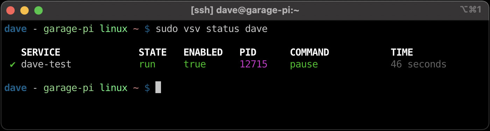
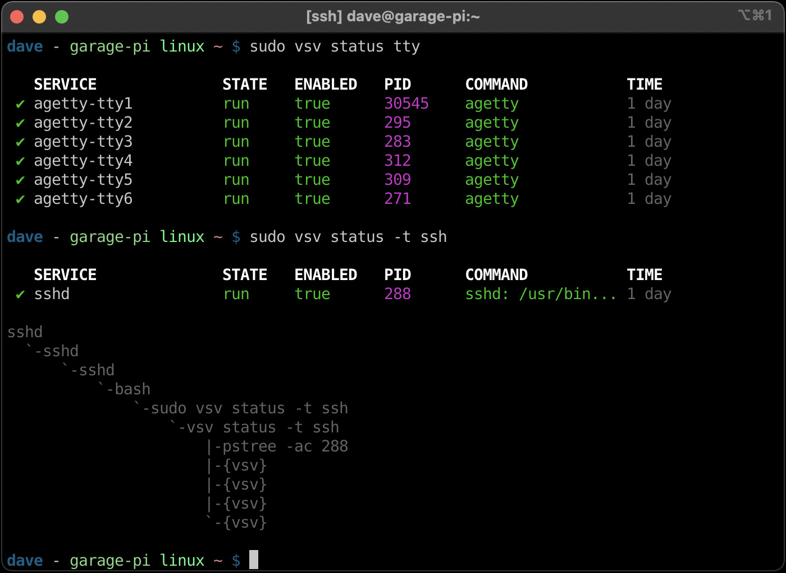
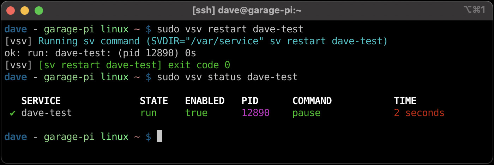
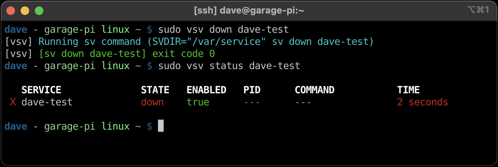
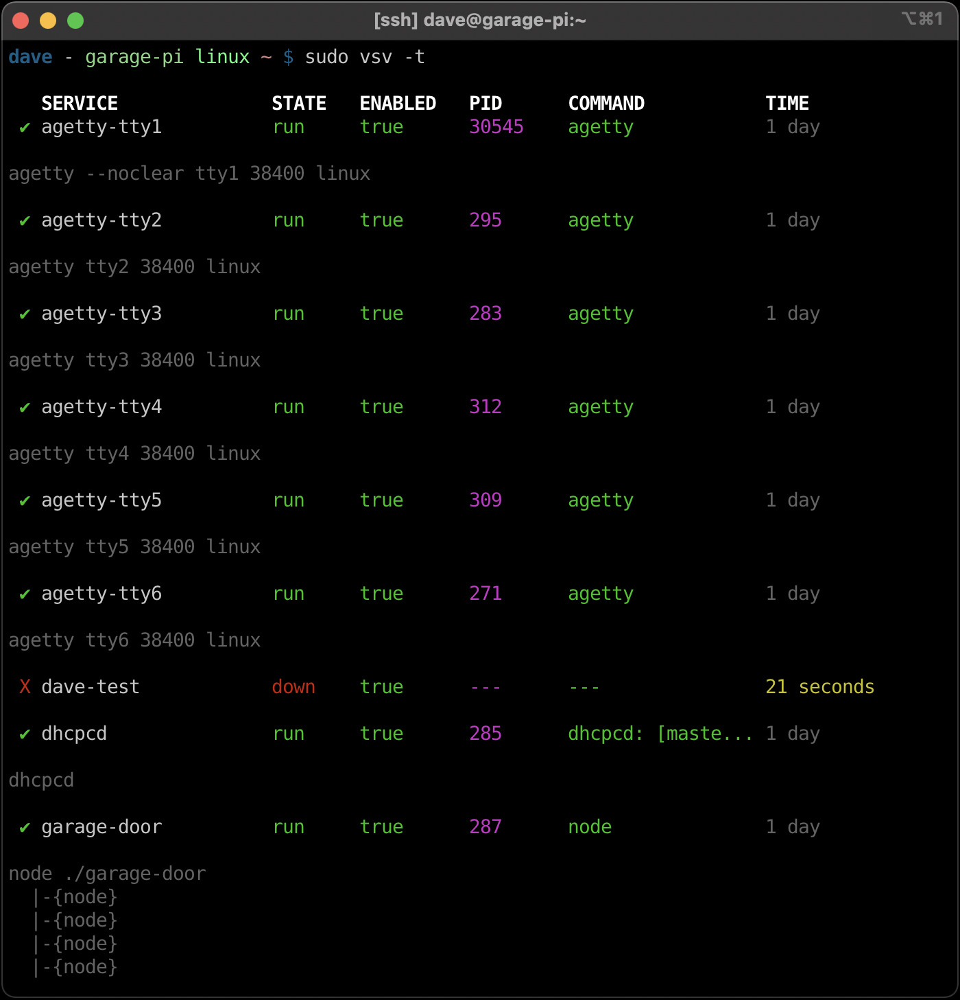

`vsv` - Void Service Manager
============================

Manage and view runit services.

**Note:** This is a rewrite in Rust of [`vsv`][vsv] which was originally written
in Bash.

`vsv` was inspired by [`vpm`][vpm].  `vsv` is to `sv` as `vpm` is to the
`xbps-*` commands.

Installation
------------

(todo)

Examples
--------

Run `vsv` without any arguments to get process status.  This is equivalent to
running `vsv status`:


**Note:** `sudo` or escalated privileges are required to determine service state
because of the strict permissions on each service's `supervise` directory.

`vsv` scans the `/var/service` directory by default, which can be overridden by
setting the `$SVDIR` environmental variable or passing in a `-d <dir>` argument.
Any service that has been in a state for less than 5 seconds will be marked
in red and any less than 30 seconds will be marked in yellow, making new or
failing services easy to spot:


We can isolate the service by passing it as a "filter" to `status`.



A string can be passed as the first argument after `status` to filter for
services that contain that string in their name.  Also, `-t` can be supplied to
`status` to print the process tree of the pid for that process:



Any command other than `status` will be passed directly to the `sv` command.
Restarting a service is as easy as `vsv restart <svc>`:



To stop a service, `vsv down <svc>` or `vsv stop <svc>` can be used:



A full service tree can be generated with `vsv -t`.  This command is equivalent
to running `vsv status -t`:



`-l` can be specified to view log services for each service as well.  This
command is equivalent to running `vsv status -l virt`:


`-t` can be specified with `-l` to view log services as a tree for each service
as well as normal services.  This command is equivalent to running `vsv status
-tl virt`:


Usage
-----

Quick Examples:

- `vsv` - show all services
- `vsv status` - same as above
- `vsv stop <svc>` - stop a service
- `vsv start <svc>` - start a service
- `vsv restart <svc>` - restart a service
- `vsv enable <svc>` - enable a service (autostart at boot)
- `vsv disable <svc>` - disable a service (no autostart at boot)
- `vsv hup <svc>` - refresh a service (`SIGHUP`)

Status:

The `status` subcommand has the following fields:

- `SERVICE` - the service (directory) name.
- `STATE` - the service state: output from `.../$service/supervise/stat`.
- `ENABLED` - if the service is enabled (lacks the `.../$service/down` file).
- `PID` - the pid of the process being monitored.
- `COMMAND` - arg0 from the pid being monitored (first field of `/proc/$pid/cmdline`.
- `TIME` - time the service has been in whatever state it is in.

Command Usage:

    $ vsv -h
     __   _______   __
     \ \ / / __\ \ / /   Void Service Manager
      \ V /\__ \\ V /    Source: https://github.com/bahamas10/vsv
       \_/ |___/ \_/     MIT License
       -------------
        Manage and view runit services
        Made specifically for Void Linux but should work anywhere
        Author: Dave Eddy <dave@daveeddy.com> (bahamas10)

    vsv 2.0.0
    Runit service manager CLI

    USAGE:
        vsv [OPTIONS] [SUBCOMMAND]

    OPTIONS:
        -c, --color <yes|no|auto>    Enable or disable color output
        -d, --dir <dir>              Directory to look into, defaults to env SVDIR or /var/service if
                                     unset
        -h, --help                   Print help information
        -l, --log                    Show log processes, this is a shortcut for `status -l`
        -t, --tree                   Tree view, this is a shortcut for `status -t`
        -u, --user                   User mode, this is a shortcut for `-d ~/runit/service`
        -v, --verbose                Increase Verbosity
        -V, --version                Print version information

    SUBCOMMANDS:
        disable    Disable service(s)
        enable     Enable service(s)
        help       Print this message or the help of the given subcommand(s)
        status     Show process status

    Any other subcommand gets passed directly to the 'sv' command, see sv(1) for
    the full list of subcommands and information about what each does specifically.
    Common subcommands:

        start <service>           Start the service
        stop <service>            Stop the service
        restart <service>         Restart the service
        reload <service>          Reload the service (send SIGHUP)

Environmental Variables:

- `SVDIR`: The directory to use, passed to the `sv` command, can be overridden
  with `-d <dir>`.
- `PROC_DIR`: A Linux procfs directory to use for command name lookups, defaults
  to `/proc`.
- `SV_PROG`: The command to use for any "external" subcommand given to `vsv`,
  defaults to `sv`.
- `PSTREE_PROG`: The command to use to get a process tree for a given pid,
  defaults to `pstree`.
- `NO_COLOR`: Set this environmental variable to disable color output.

Syntax
------

All source code should be clean of `cargo clippy` and `cargo fmt`.  You can use
`make` to ensure this:

```
$ make check
cargo check
    Finished dev [unoptimized + debuginfo] target(s) in 0.01s
cargo clippy
    Finished dev [unoptimized + debuginfo] target(s) in 0.12s
$ make fmt
cargo fmt
```

License
-------

MIT License

[vpm]: https://github.com/netzverweigerer/vpm
[vsv]: https://github.com/bahamas10/vsv
